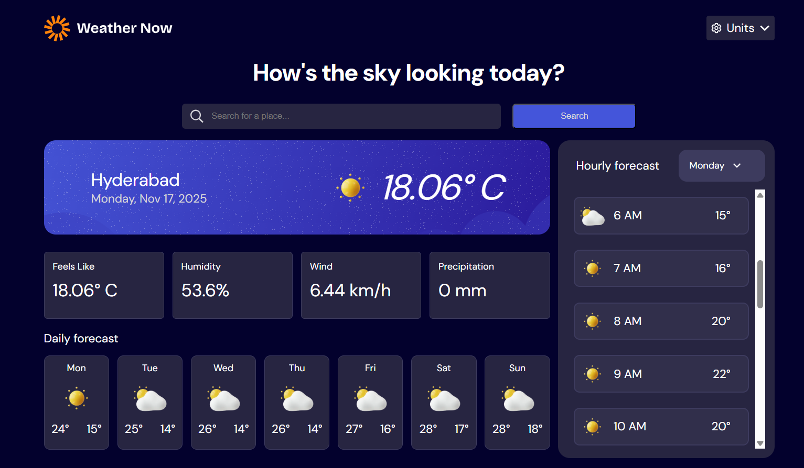

# Weather Now

**Weather Now** is a JavaScript weather application with a clean, responsive UI.  
Built as part of **The Odin Project – JavaScript Course**, it demonstrates practical usage of `async/await`, external API consumption (Visual Crossing), state-based unit toggles, and an interactive day selector for browsing weekly weather conditions.

## 

## Features

1. **Search any location** to view current weather conditions.
2. **Hourly and daily forecasts** presented clearly at a glance.
3. **Unit toggles** for:
   - Temperature: `°C ↔ °F`
   - Wind Speed: `km/h ↔ mph`
   - Precipitation: `mm ↔ in`
4. **Selectable day of the week** to inspect detailed weather conditions.

---

## Tech Stack

- **Frontend:** HTML, CSS, JavaScript (ES Modules)
- **API:** Visual Crossing Weather API
- **Bundler:** webpack (with webpack-dev-server)
- **Code Quality:** ESLint + Prettier

---

## Notes

Weather data is powered by the Visual Crossing Weather API.  
Built as a project in The Odin Project curriculum to practice real-world frontend patterns.
