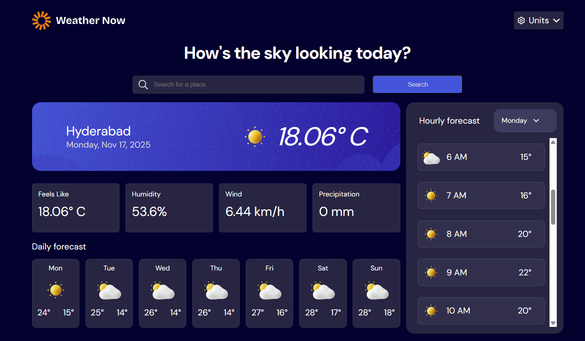

# Weather Now

[Live Preview](https://narendar-reddy-p.github.io/weather-app/)

**Weather Now** is a JavaScript weather application with a clean, responsive UI.  
Built as part of **The Odin Project – JavaScript Course**, it demonstrates practical usage of `async/await`, external API consumption (Visual Crossing), state-based unit toggles, and an interactive day selector for browsing weekly weather conditions.

## 

## Features

1. **Search any location** to view current weather conditions.
2. **Hourly and daily forecasts** presented clearly at a glance.
3. **Unit toggles** for:
   - Temperature: `°C ↔ °F`
   - Wind Speed: `km/h ↔ mph`
   - Precipitation: `mm ↔ in`
4. **Selectable day of the week** to inspect detailed weather conditions.

---

## Tech Stack

- **Frontend:** HTML, CSS, JavaScript (ES Modules)
- **API:** Visual Crossing Weather API
- **Bundler:** webpack (with webpack-dev-server)
- **Code Quality:** ESLint + Prettier

---

## Installation / Local Development

To run this project locally, follow these steps:

1. **Clone the repository:**
   ```bash
   git clone https://github.com/Narendar-Reddy-P/weather-app.git
   ```
2. **Navigate to the project directory:**
   ```bash
   cd weather-app
   ```
3. **Install the dependencies:**
   ```bash
   npm install
   ```
4. **Start the development server:**
   ```bash
   npm run dev
   ```
   *The application will automatically open in your default browser.*

*(Optional) To build the project for production, run:*
```bash
npm run build
```

---

## Notes

Weather data is powered by the Visual Crossing Weather API.  
Built as a project in The Odin Project curriculum to practice real-world frontend patterns.  
UI design is taken from [Frontend Mentor](https://www.frontendmentor.io/).
